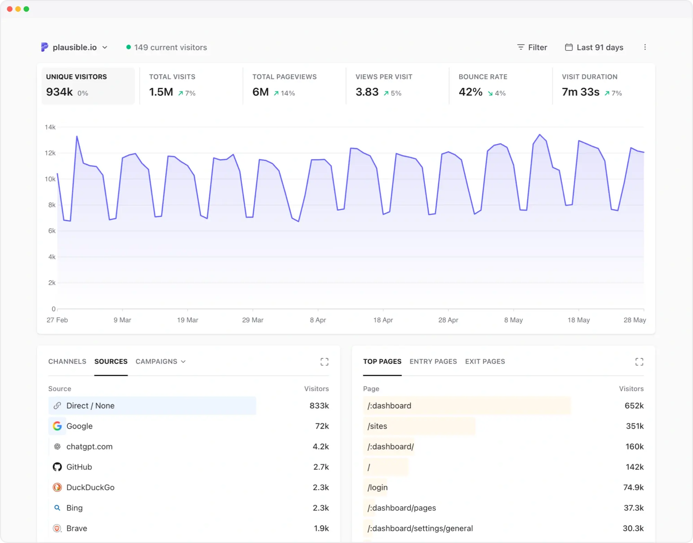

# Plausible Analytics

  

    <a href="https://plausible.io/plausible.io">Live Demo</a> |
    <a href="https://plausible.io/open-source-website-analytics">Open Source</a> |
    <a href="https://plausible.io/docs">Docs</a> |
    <a href="https://github.com/plausible/analytics/blob/master/CONTRIBUTING.md">Contributing</a>
      

[Plausible Analytics](https://plausible.io/) is an open source, privacy-first web analytics tool. Lightweight, cookie-free [alternative to Google Analytics](https://plausible.io/blog/remove-google-analytics). Available in managed cloud or self-hosted community edition.

- 🔐 [Privacy-focused](https://plausible.io/privacy-focused-web-analytics)
- 🛡️ [GDPR, CCPA, PECR compliant](https://plausible.io/data-policy)
- 📊 [Simple, fast dashboard](https://plausible.io/simple-web-analytics)
- 🪶 [Lightweight script](https://plausible.io/lightweight-web-analytics)
- 🇪🇺 [Made and hosted in the EU](https://plausible.io/eu-hosted-web-analytics)

## Why Plausible?

Here's what makes Plausible a great Google Analytics alternative and why we're trusted by thousands of paying subscribers to deliver their website and business insights:

- **Clutter-free**  
  Plausible provides [simple web analytics](https://plausible.io/simple-web-analytics) that cut through the noise. No layers of menus or need to create custom reports. All key insights are on a single page, with no training required.

- **Privacy-first and compliant**  
  Measure traffic, not individuals. No personal data or IP addresses are stored, and no cookies or persistent identifiers are used. Fully compliant with GDPR, CCPA and PECR.  
  [Read more about our data policy](https://plausible.io/data-policy)

- **Lightweight**  
  Our script is [tiny](https://plausible.io/lightweight-web-analytics), helping your website load faster. You can also send events directly to our [events API](https://plausible.io/docs/events-api).

- **Built for modern workflows**  
  Works with modern frameworks and supports SPAs out of the box, including pushState and hash-based routing. See [details](https://plausible.io/docs/hash-based-routing).

- **Define key goals and track conversions**  
  Track goals, conversions, revenue attribution and funnels using custom events and dimensions. Turn on codeless tracking for outbound link clicks, form completions, file downloads and 404 error pages.

- **Easy reporting and sharing**  
  Get weekly or monthly reports via email or Slack, including traffic spike/drop notifications. [Invite team members](https://plausible.io/docs/users-roles) with role-based access, share dashboards publicly or with anyone using a simple link. Make your analytics transparent by default.

- **Search insights included**  
  Integrate with Google Search Console to get accurate keyword data directly in your dashboard.

- **API and integrations**  
  Send events directly via our API and export your stats using the stats API or CSV. Build custom workflows and integrations on top of your data.

- **Real-time insights**  
  Monitor live traffic and understand what’s happening on your site as it happens.

- **Smooth transition from Google Analytics**  
  Familiar metrics, campaign tracking and Search Console integration. Import your historical Google Analytics stats and continue where you left off.

Thousands of teams use Plausible to understand their traffic without sacrificing privacy or simplicity. Learn how to [get the most out of your Plausible experience](https://plausible.io/docs/your-plausible-experience).

We are dedicated to making web analytics more privacy-friendly. Our mission is to reduce corporate surveillance by providing an alternative web analytics tool which doesn’t come from the AdTech world. We are completely independent and solely funded by our subscribers.  

Interested to learn more? [Read more on our website](https://plausible.io), learn more about the team and our goals on [our about page](https://plausible.io/about) or explore [the documentation](https://plausible.io/docs). 

## Why is Plausible Analytics Cloud not free like Google Analytics?

Plausible is an independent, open source project funded entirely by our users. We charge a subscription to sustainably develop, maintain and improve the product over the long term.

Google Analytics is free to use because Google monetizes user data for advertising. That model comes with trade-offs: data collection, complexity and additional overhead for compliance and consent.

With Plausible, the business model is simple:

- No data collection beyond aggregated, anonymized stats  
- No third-party data sharing  
- No advertising or tracking ecosystem  
- You fully own and control your data  

We believe paying for analytics should be straightforward. You pay for a product, not with your users’ data, but with a transparent subscription. [Learn more](https://plausible.io/paid-analytics-vs-free-ga).

## Getting started with Plausible

The easiest way to get started with Plausible Analytics is with [our official managed service in the cloud](https://plausible.io/register).

- Takes ~2 minutes to set up  
- Global CDN, high availability, backups and security included  
- No maintenance required

In order to be compliant with the GDPR and the Schrems II ruling, all visitor data for our managed service in the cloud is exclusively processed on servers and cloud infrastructure owned and operated by European providers. Your website data never leaves the EU.

Our managed hosting can save a substantial amount of developer time and resources. For most sites this ends up being the best value option and the revenue goes to funding the maintenance and further development of Plausible. So you’ll be supporting open source software and getting a great service!

### Can Plausible be self-hosted?

Plausible is [open source web analytics](https://plausible.io/open-source-website-analytics) and we have a free as in beer and self-hosted solution called [Plausible Community Edition (CE)](https://plausible.io/self-hosted-web-analytics). Here are the differences between Plausible Analytics managed hosting in the cloud and the Plausible CE:

|  | Plausible Analytics Cloud  | Plausible Community Edition |
| ------------- | ------------- | ------------- |
| **Infrastructure management** | Easy and convenient. It takes 2 minutes to start counting your stats with a worldwide CDN, high availability, backups, security and maintenance all done for you by us. We manage everything so you don’t have to worry about anything and can focus on your stats. | You do it all yourself. You need to get a server and you need to manage your infrastructure. You are responsible for installation, maintenance, upgrades, server capacity, uptime, backup, security, stability, consistency, loading time and so on.|
| **Release schedule** | Continuously developed and improved with new features and updates multiple times per week. | [It's a long term release](https://plausible.io/blog/building-open-source) published twice per year so latest features and improvements won't be immediately available.|
| **Premium features** | All features available as listed in [our pricing plans](https://plausible.io/#pricing). | Premium features (marketing funnels, ecommerce revenue goals, SSO and sites API) are not available in order to help support [the project's long-term sustainability](https://plausible.io/blog/community-edition).|
| **Bot filtering** | Advanced bot filtering for more accurate stats. Our algorithm detects and excludes non-human traffic patterns. We also exclude known bots by the User-Agent header and filter out traffic from data centers and referrer spam domains. We exclude ~32K data center IP ranges (i.e. a lot of bot IP addresses) by default. | Basic bot filtering that targets the most common non-human traffic based on the User-Agent header and referrer spam domains.|
| **Server location** | All visitor data is exclusively processed on EU-owned cloud infrastructure. We keep your site data on a secure, encrypted and green energy powered server in Germany. This ensures that your site data is protected by the strict European Union data privacy laws and ensures compliance with GDPR. Your website data never leaves the EU. | You have full control and can host your instance on any server in any country that you wish. Host it on a server in your basement or host it with any cloud provider wherever you want, even those that are not GDPR compliant.|
| **Data portability** | You see all your site stats and metrics on our modern-looking, simple to use and fast loading dashboard. You can only see the stats aggregated in the dashboard. You can download the stats using the [CSV export](https://plausible.io/docs/export-stats), [stats API](https://plausible.io/docs/stats-api) or the [Looker Studio Connector](https://plausible.io/docs/looker-studio). | Do you want access to the raw data? Self-hosting gives you that option. You can take the data directly from the ClickHouse database. The Looker Studio Connector is not available. |
| **Premium support** | Real support delivered by real human beings who build and maintain Plausible. | Premium support is not included. CE is community supported only.|
| **Costs** | There's a cost associated with providing an analytics service so we charge a subscription fee. We choose the subscription business model rather than the business model of surveillance capitalism. Your money funds further development of Plausible. | You need to pay for your server, CDN, backups and whatever other cost there is associated with running the infrastructure. You never have to pay any fees to us. Your money goes to 3rd party companies with no connection to us.|

Interested in self-hosting Plausible CE on your server? Take a look at our [Plausible CE installation instructions](https://github.com/plausible/community-edition/).

Plausible CE is a community supported project and there are no guarantees that you will get support from the creators of Plausible to troubleshoot your self-hosting issues. There is a [community supported forum](https://github.com/plausible/analytics/discussions/categories/self-hosted-support) where you can ask for help.

Our only source of funding is our premium, managed service for running Plausible in the cloud.
 
## Technology

Plausible is built with a modern, scalable stack:

- **Backend**: Elixir + Phoenix  
- **Databases**: PostgreSQL (general data), ClickHouse (analytics)  
- **Frontend**: React + [TailwindCSS](https://tailwindcss.com/)  

Our architecture allows Plausible to handle large volumes of traffic efficiently while keeping the dashboard fast and responsive.

## Contributors

For anyone wishing to contribute to Plausible, we recommend taking a look at [our contributor guide](https://github.com/plausible/analytics/blob/master/CONTRIBUTING.md).

## Feedback & Roadmap

We welcome feedback from our community. We have a public roadmap driven by the features suggested by the community members. Take a look at our [feedback board](https://plausible.io/feedback). Please let us know if you have any requests and vote on open issues so we can better prioritize.

To stay up to date with all the latest news and product updates, make sure to follow us on [X (formerly Twitter)](https://twitter.com/plausiblehq), [Bluesky](https://bsky.app/profile/plausible.io), [LinkedIn](https://www.linkedin.com/company/plausible-analytics/) and [Mastodon](https://fosstodon.org/@plausible).

## License & Trademarks

Plausible CE is open source under the GNU Affero General Public License Version 3 (AGPLv3) or any later version. You can [find it here](https://github.com/plausible/analytics/blob/master/LICENSE.md).

To avoid issues with AGPL virality, we've released the JavaScript tracker which gets included on your website under the MIT license. You can [find it here](https://github.com/plausible/analytics/blob/master/tracker/LICENSE.md).

Copyright (c) 2018-present Plausible Insights OÜ. Plausible Analytics name and logo are trademarks of Plausible Insights OÜ. Please see our [trademark guidelines](https://plausible.io/trademark) for info on acceptable usage.
