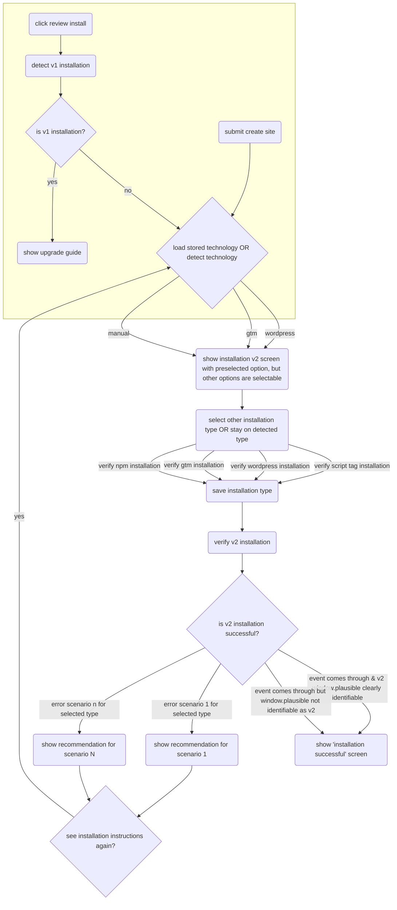

```mermaid
flowchart TD
    review_install("click review install")
    detect_v1_installation("detect v1 installation")
    detect_v1{"is v1 installation?"}
    show_upgrade_guide("show upgrade guide")
    create_site("submit create site")
    load_or_detect_tech{"load stored technology OR detect technology"}
    select_type("select other installation type OR stay on detected type")
    save_type("save installation type")
    verify_v2_installation("verify v2 installation")
    verify_v2_successful{"is v2 installation successful?"}
    finish("show 'installation successful' screen")
    helpful_recommendation{"see installation instructions again?"}
    show_installation_v2_screen("show installation v2 screen with preselected option, but other options are selectable")
    recommendation_1("show recommendation for scenario 1")
    recommendation_n("show recommendation for scenario N")

    subgraph " "
    create_site --> load_or_detect_tech
    review_install --> detect_v1_installation
    detect_v1_installation --> detect_v1
    detect_v1 -->|no| load_or_detect_tech
    detect_v1 -->|yes| show_upgrade_guide
    end
    load_or_detect_tech -->|wordpress| show_installation_v2_screen
    show_installation_v2_screen --> select_type
    select_type -->|verify script tag installation| save_type
    select_type -->|verify wordpress installation| save_type
    select_type -->|verify gtm installation| save_type
    select_type -->|verify npm installation| save_type
    save_type --> verify_v2_installation
    verify_v2_installation --> verify_v2_successful
    load_or_detect_tech -->|gtm| show_installation_v2_screen
    load_or_detect_tech -->|manual| show_installation_v2_screen
    verify_v2_successful -->|event comes through & v2 window.plausible clearly identifiable| finish
    verify_v2_successful -->|event comes through but window.plausible not identifiable as v2| finish
    verify_v2_successful -->|error scenario 1 for selected type| recommendation_1
    verify_v2_successful -->|error scenario n for selected type| recommendation_n
    recommendation_1 --> helpful_recommendation
    recommendation_n --> helpful_recommendation
    helpful_recommendation -->|yes| load_or_detect_tech
```
